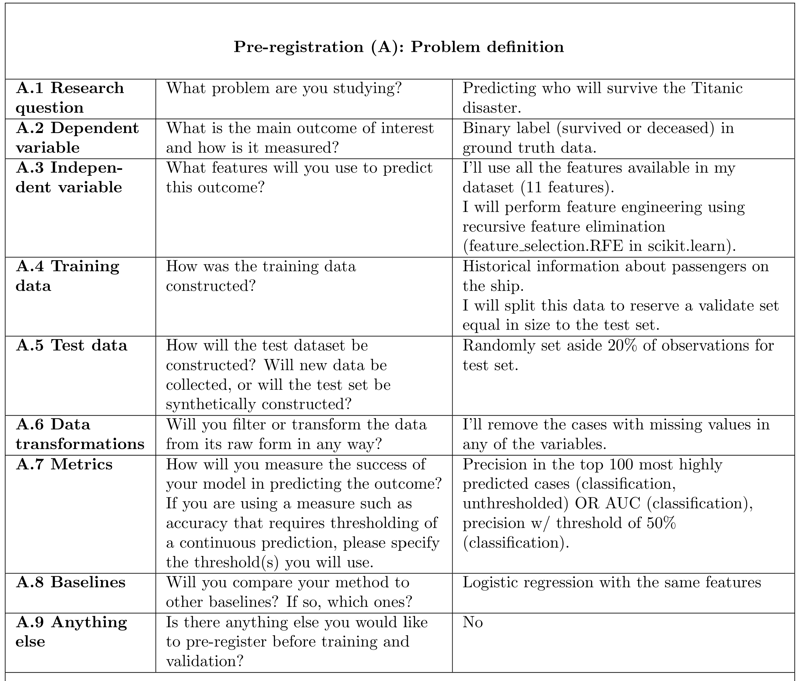
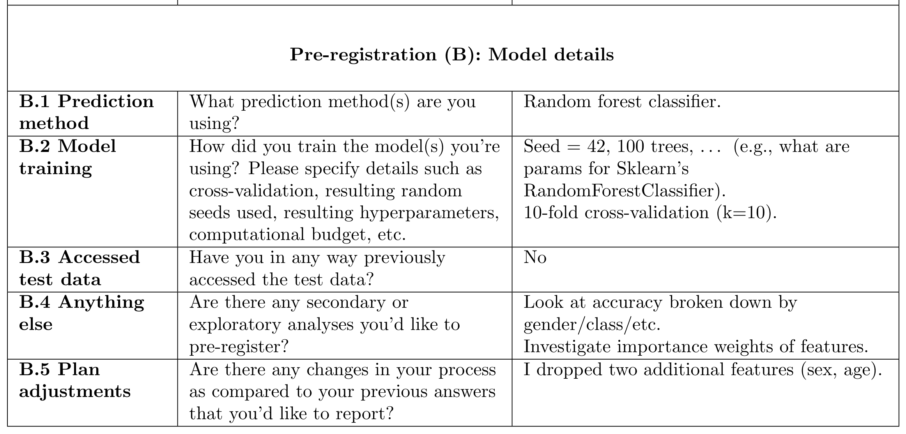

# Preregistration for Predicting Modeling | An easy-to-use template

This repo aims to make preregistration easy for new predictive modeling projects. It provides a lightweight template that can be added to any project repo before starting. The template is in markdown and is compatible with all kinds of code repositories. Simply fill form A  at the start of the project and form B before model testing, and you are all set!

## Quick Start

1. Fork this repo. 
2. Fill out the preregistrationA.md form. 
3. Start your analysis and add code to the repo. 
4. Before testing the model, complete preregistrationB.md form.

If needed, the preregistration details can be edited. Git stores the timestamps of each edit and provides a simple way to browsing edits through `git diff`. 

## Example
Here's an example preregistration.

## Preprint
For details about the preregistration process, check out the associated paper.

[Preregistration for predictive modeling | Arxiv](https://arxiv.org/abs/2311.18807)
Jake Hofman, Angelos Chatzimparmpas, Amit Sharma, Duncan J. Watts, Jessica Hullman

Amid rising concerns of reproducibility and generalizability in predictive modeling, we explore the possibility and potential benefits of introducing pre-registration to the field. Despite notable advancements in predictive modeling, spanning core machine learning tasks to various scientific applications, challenges such as overlooked contextual factors, data-dependent decision-making, and unintentional re-use of test data have raised questions about the integrity of results. To address these issues, we propose adapting pre-registration practices from explanatory modeling to predictive modeling. We discuss current best practices in predictive modeling and their limitations, introduce a lightweight pre-registration template, and present a qualitative study with machine learning researchers to gain insight into the effectiveness of pre-registration in preventing biased estimates and promoting more reliable research outcomes. We conclude by exploring the scope of problems that pre-registration can address in predictive modeling and acknowledging its limitations within this context.

